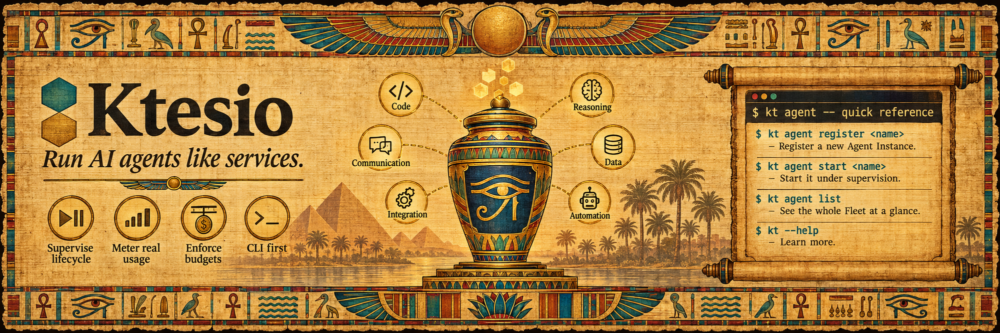

<p align="center">
  
</p>

# Ktesio

[](https://github.com/iMagdy/ktesio/actions/workflows/ci.yml)
[](https://crates.io/crates/ktesio)
[](LICENSE)

Ktesio is a Rust CLI and engine that **runs AI agents like services** — supervise their lifecycle, meter real token usage, and enforce dollar budgets. Register any agent, start and stop it under supervision, watch what it actually consumes, and set token and cost ceilings that stop runaway spend the moment they are crossed.

## Why Ktesio?

Long-running AI agents are processes that cost money on every call. Ktesio treats them like the services they are:

- **Lifecycle — run agents like services.** `start`, `stop`, `pause`, and `resume` any registered agent through one uniform state machine, with crash detection, a configurable Restart Policy, captured logs, and durable state (one SQLite database) that survives an engine restart or reboot and reconciles orphaned processes honestly.
- **Metering — real token usage.** Every registered agent declares a Metering Source, and the engine records real per-run and cumulative token totals into a durable Usage Ledger. Usage is either **self-reported** by the agent or **engine-observed** through a loopback proxy, so governance never depends on the agent's cooperation.
- **Budgets & cost control — ceilings that actually stop spend.** Set per-run and cumulative **token** budgets, and (with a configured Rate) **dollar** cost caps. Each carries a Breach Action — `pause`, `stop`, or `warn` — enforced the instant a ceiling is reached, in the same commit path as the usage that crossed it. Every dollar figure is integer micro-dollars, labeled an estimate.
- **One vocabulary, any agent.** Register a native builtin, or bring your own agent with a small `adapter.toml` manifest that declares how to launch it, its per-OS capabilities, and its metering source. Configure every agent through one layered-TOML config with per-value provenance and `secret:NAME` references that stay masked in Ktesio's surfaces.

## Install

Ktesio ships a single `kt` binary for macOS, Linux, and Windows.

Install on macOS or Linux:

```bash
curl -fsSL https://cli.ktesio.dev/install.sh | sh
```

Install on Windows with PowerShell:

```powershell
irm https://cli.ktesio.dev/install.ps1 | iex
```

New macOS and Linux installs prefer Homebrew, then Cargo, then a prebuilt GitHub
Release binary. New Windows installs prefer Cargo, then a prebuilt GitHub Release
binary. The installer preserves an existing install channel when it can.

If you already have Rust, install from crates.io (the `ktesio` package installs the `kt` binary):

```bash
cargo install ktesio
```

Or with Homebrew:

```bash
brew install imagdy/tap/ktesio
```

You can also download a release archive from [GitHub Releases](https://github.com/iMagdy/ktesio/releases), unpack it, and place `kt` on your `PATH`, or build from source:

```bash
git clone https://github.com/iMagdy/ktesio.git
cd ktesio
cargo install --path .
```

See the [installation guide](docs/installation.md) for update behavior and per-platform notes.

## Quickstart

Register an agent, give it a budget, inspect it, and run it under supervision.

### 1. Describe your agent with a manifest adapter

An agent is registered through an `adapter.toml` that declares how to launch it, its per-OS capabilities, and its metering source. Create a directory `my-agent/` with an `adapter.toml`:

```toml
contract_version = "0.4.0"

[adapter]
kind = "my-agent"
name = "My Agent"

# How the engine launches the agent process. exec must be on PATH (or an
# absolute path); args/env are optional. Replace this with your agent's command.
[lifecycle.start]
exec = "my-agent"
args = ["--serve"]

# A non-empty, per-OS Capability Declaration. "pause" is guaranteed on Unix
# (SIGSTOP) and best-effort on Windows.
[capabilities.pause]
linux = "guaranteed"
macos = "guaranteed"
windows = "best-effort"

[capabilities.interaction]
linux = "guaranteed"
macos = "guaranteed"
windows = "guaranteed"

# A viable Metering Source: "self-reported" (the agent emits its own usage) or
# "engine-observed" (the engine meters model traffic through a loopback proxy).
[metering]
source = "self-reported"
```

Register it under a Fleet-unique name:

```bash
kt agent register my-agent --manifest ./my-agent
```

Registration validates the manifest first, then creates an isolated Agent Home and prints its path plus the effective (current-OS) Capability Declaration. (To try the flow without writing a manifest, `kt agent register demo --kind mock` registers a native builtin — note that `mock` has no launch command, so it cannot be started.)

### 2. Set a budget and a cost cap

Budgets are ordinary layered-config values, inspectable and changeable at any time:

```bash
# Cap cumulative token usage and pause the agent on breach.
kt agent config set my-agent budget.tokens.cumulative 500000
kt agent config set my-agent budget.breach_action pause

# Optional: price tokens ($/1M) so token usage derives a dollar cost, then cap it.
kt agent config set my-agent cost.rate.input 3.00
kt agent config set my-agent cost.rate.output 15.00
kt agent config set my-agent budget.dollars.cumulative 10.00
```

### 3. Inspect the Fleet

```bash
kt agent list            # a table: name, kind, state, restarts, budget, usage
kt agent show my-agent   # one instance: capabilities, state, budget, usage, cost, metering source
kt agent config get my-agent   # the effective config, with the source layer of each value
```

`kt agent list --json` and `kt agent show my-agent --json` emit a versioned, machine-readable document. Token totals are the Usage Ledger sums exactly; dollar figures appear only when a Rate is configured and are always labeled estimates.

### 4. Run it under supervision

```bash
kt agent start my-agent
kt agent pause my-agent      # honest per-OS: guaranteed / best-effort / unsupported
kt agent resume my-agent
kt agent stop my-agent --timeout 10   # graceful, then a forced kill after the window
```

> **Supervision boundary (current behavior):** a standalone `kt agent start` supervises the process only for that command's lifetime and stops it when the command exits; durable supervision across separate CLI invocations is future work (the supervising daemon is a later epic). If the engine crashes with a surviving process, the next engine open re-adopts it, detects crashes, and applies the Restart Policy.

## Commands

The agent runner lives under `kt agent`. Every command supports `--help`.

| Command | Purpose |
|---------|---------|
| `kt agent register` | Register an instance from a native builtin (`--kind`) or an `adapter.toml` manifest adapter (`--manifest`) |
| `kt agent list` | List every Agent Instance in the Fleet |
| `kt agent show` | Show one instance's capabilities, runtime status, usage, and budget |
| `kt agent usage` | Read Usage Ledger totals for one instance, or Fleet-wide |
| `kt agent start` / `stop` / `pause` / `resume` | Drive the lifecycle |
| `kt agent send` | Send a line of input to a running instance's stdin |
| `kt agent logs` | Read an instance's retained output (`--follow` to stream, `--json` emits NDJSON) |
| `kt agent remove` | Remove an instance (retain or delete its Agent Home; `--force` if running) |
| `kt agent config set` / `get` | Write and read the layered config (validated; `--reveal` un-masks secrets) |
| `kt agent memory attach` / `detach` | Attach or detach a Memory Backing (`filesystem` or `native`) |

See the [command reference](docs/commands.md) for arguments, flags, and the unified config keys, and the [exit-code table](docs/commands.md#exit-codes) for the documented numeric codes every command returns.

## Documentation

- [Getting started](docs/get-started.md)
- [Installation](docs/installation.md)
- [Command reference](docs/commands.md)
- [Adapter manifest (`adapter.toml`)](docs/manifest.md)
- [Architecture](docs/architecture.md)
- [Testing](docs/testing.md)
- [Release process](docs/release-process.md)
- [Troubleshooting](docs/troubleshooting.md)
- [Contributing](CONTRIBUTING.md)

## Project Status

Ktesio is early and moving fast. The lifecycle, layered configuration, secrets, the Usage Ledger, token budgets, dollar cost caps, and engine-observed metering are implemented today. A supervising daemon (durable cross-invocation supervision and a Host event stream) and a richer native adapter surface are on the roadmap.

## License

Ktesio is **source-available**, licensed under the [PolyForm Noncommercial License 1.0.0](LICENSE).

- **Noncommercial use is free.** You may use, copy, modify, and share Ktesio for any noncommercial purpose under the terms of the license.
- **Commercial use requires a separate license.** Any commercial use needs the prior written permission of the copyright holder, Islam Magdy. To request a commercial license, open an issue or contact the maintainer through the project's official channels.

This is source-available software, not an OSI-approved open source license.

## Contributing

Contributions are welcome under the project's [Contributor License Agreement](CLA.md): anyone can contribute, but you assign copyright in your contribution to the project owner so Ktesio stays under unified ownership. See [CONTRIBUTING.md](CONTRIBUTING.md) and [CLA.md](CLA.md) for details.
