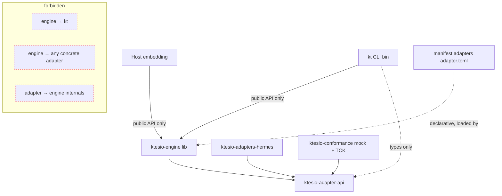
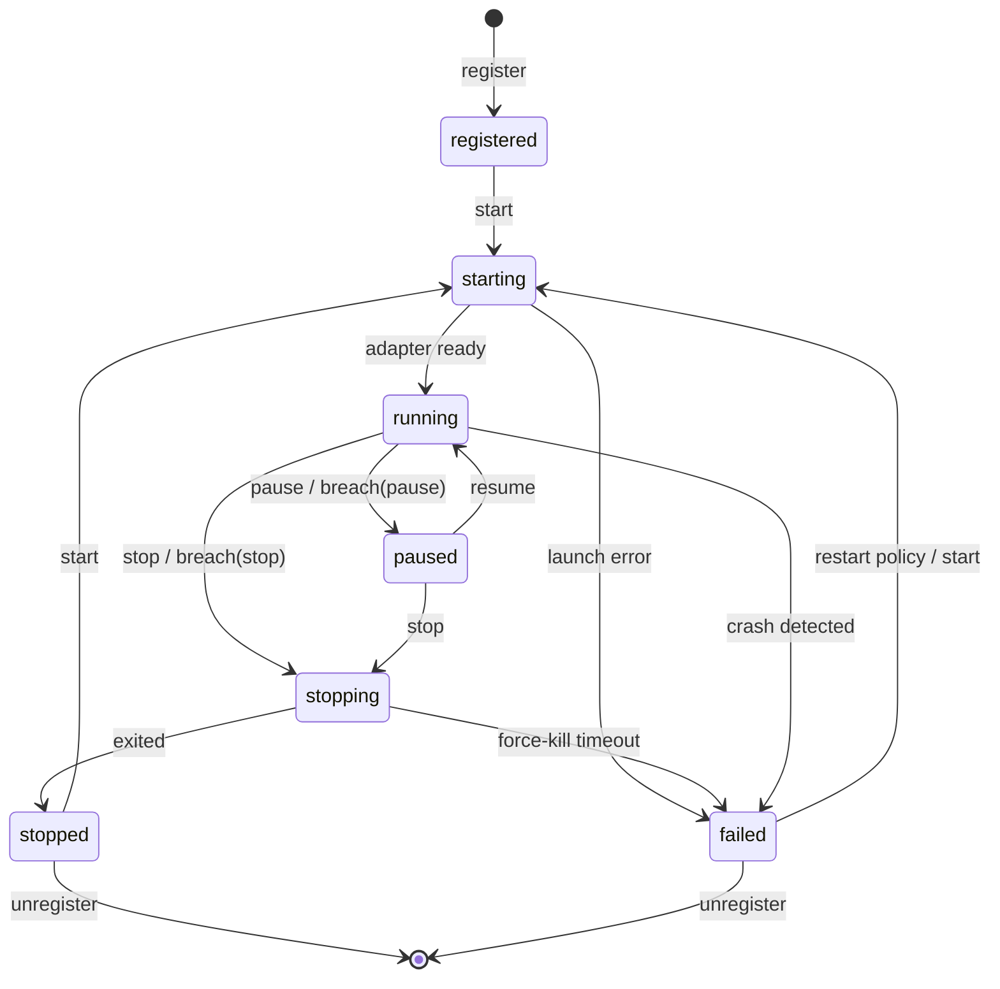
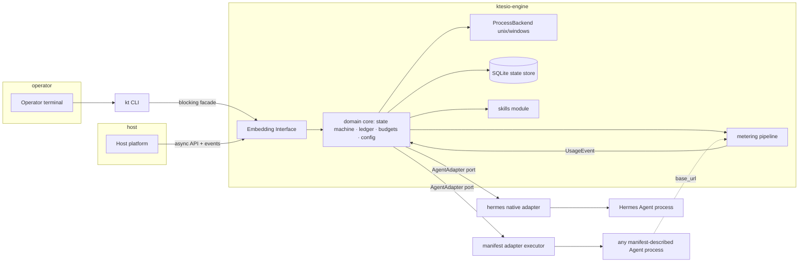

# Architecture Spine — ktesio-runtime-engine

## Design Paradigm

**Hexagonal (ports & adapters) around a supervised-process core.** The engine core is pure domain — lifecycle state machine, Usage Ledger, budget evaluation, config resolution — and knows nothing about any specific Agent, OS, or frontend. All variability enters through ports:

- **Downward port:** `AgentAdapter` (the Adapter Contract) — how Agents plug in.
- **Upward port:** the Embedding Interface — the `ktesio-engine` crate's public API; `kt` and Hosts are peer consumers of it.
- **Side ports:** `MeteringSource`, `MemoryBacking`, `StateStore`, `ProcessBackend` (per-OS), `SecretResolver`.

Layer ↔ code mapping: core = `ktesio-engine::domain`, ports = `ktesio-engine::ports` + `ktesio-adapter-api`, adapters/frontends = `ktesio-adapters-*`, `ktesio-engine::backends::{unix,windows}`, `kt`.

## Invariants & Rules



### AD-1 — Hexagonal core; domain logic lives only in the engine core
- **Binds:** all
- **Prevents:** business rules (budget math, state transitions, config precedence) duplicating or diverging across CLI, adapters, or OS backends — the failure that breaks SM-1's "identical controls."
- **Rule:** `ktesio-engine::domain` has no dependency on any adapter crate, OS-conditional code, or terminal/UX crate. Anything agent-, OS-, or frontend-specific enters through a port trait.

### AD-2 — Workspace shape and the public-API boundary
- **Binds:** all; FR-31, FR-32, §7 (PRD)
- **Prevents:** `kt` reaching engine internals, and third-party adapter authors depending on the whole engine.
- **Rule:** Cargo workspace with exactly these publishable crates: `ktesio-engine` (lib; its public API *is* the Embedding Interface), `ktesio-adapter-api` (contract types/traits, independently semver'd), `ktesio-adapters-hermes`, `ktesio-conformance` (TCK + mock adapter), `kt` (bin). `kt` depends only on `ktesio-engine`'s public API (+ `ktesio-adapter-api` types). CI enforces: crate-visibility compilation + a semver-check job on `ktesio-engine` and `ktesio-adapter-api`.

### AD-3 — Two adapter kinds, one trait
- **Binds:** FR-1, FR-27..30, §4.7
- **Prevents:** a second, incompatible extension mechanism emerging (dylibs, embedded scripting) and per-agent one-off integration code inside the engine.
- **Rule:** every Agent integrates as an `AgentAdapter` implementation of exactly one kind: **native** (Rust impl compiled into the workspace: `hermes`, conformance `mock`) or **manifest** (a directory with `adapter.toml` declaring lifecycle exec/args/env templates, capability declaration, metering-source config, interaction wiring — loadable by path at registration). No dynamic library loading. The generic manifest executor lives in the engine; manifests carry no code. The manifest schema is itself part of the Adapter Contract: its types and validation are defined only in `ktesio-adapter-api` and versioned under the same contract semver — the engine executor consumes that crate's parsed form and never defines its own schema.

### AD-4 — Per-OS process control via `ProcessBackend`; capabilities are (capability × OS)
- **Binds:** FR-5..9, NFR-1, NFR-2
- **Prevents:** Unix-shaped supervision silently lying on Windows (especially pause).
- **Rule:** all process operations go through the `ProcessBackend` port. Unix backend: spawn into a dedicated process group; stop = SIGTERM → SIGKILL after the graceful window (default 30s, per-instance configurable); pause via SIGSTOP/SIGCONT only when the adapter declares `pause: guaranteed-via-signal`. Windows backend: one Job Object per Agent Instance; stop = graceful request → `TerminateJobObject`; pause is adapter-cooperative only. Capability Declarations are keyed per OS; the engine surfaces the *effective* (current-OS) declaration everywhere capabilities are shown.
- **Projection clause (post-impl refinement from 1-3 review F3, ratified by Islam 2026-07-04):** the persisted adapter snapshot in the Agent Home stores the **full** per-OS Capability Declaration, NOT a register-time single-OS projection. The effective (current-OS) declaration is projected onto the **running** OS at READ time (`effective_capabilities` / `kt agent show`), not frozen to the registering OS. This keeps the state directory portable — a home registered on one OS projects correctly when later read on another.

### AD-5 — Write-ahead spawn records; orphan adoption on start
- **Binds:** FR-9, FR-10, NFR-1
- **Prevents:** orphan agent processes after an engine crash, and PID-reuse false adoption.
- **Rule:** before exec completes, persist {instance id, PID, process start-time fingerprint}. On engine start, reconcile every record against live processes: fingerprint match → adopt supervision; no match → mark `failed` with last-known cause. No spawn without its record committed first.

### AD-6 — SQLite is the one state store; Agent Homes hold bulky artifacts
- **Binds:** FR-10, FR-18..22, NFR-4
- **Prevents:** concurrent `kt`/embedded-host access corrupting JSON state files; ledger data loss on crash.
- **Rule:** all registry, lifecycle, budget, and Usage Ledger state lives in one SQLite database (rusqlite, bundled SQLite, WAL, `synchronous=NORMAL`) under the engine state dir. Usage Ledger = append-only `usage_events` + rollup aggregates; one transaction per usage event (durability loss bound ≤1s, superseding the PRD's ≤5s placeholder). Logs, memory dirs, Skill Sets, and effective-config snapshots are files inside the Agent Home — never blobs in the DB.

### AD-7 — One metering/enforcement pipeline
- **Binds:** FR-18..23, SM-2
- **Prevents:** budget checks scattered across call sites, each with its own race against the ledger.
- **Rule:** `MeteringSource` → UsageEvent → ledger transaction → `BudgetEvaluator` (inside the same commit path) → BreachDecision → supervisor executes the Breach Action (default `pause`) and emits the breach event. No other code path may mutate the Usage Ledger or trigger Breach Actions. A **Run** is the span from a `starting` transition to the next terminal state (`stopped`/`failed`) of that Agent Instance — "per-run" budget scope means exactly this span, and every UsageEvent carries at minimum {instance id, run id, input tokens, output tokens, metering source, timestamp}. v1 `engine-observed` source = loopback-only HTTP forward listener the adapter points the Agent's OpenAI-compatible `base_url` at, parsing standard usage fields. `[ASSUMPTION: OpenAI-compatible usage JSON covers v1 targets; other provider schemas are Deferred.]` (Run is absent from the PRD Glossary — flagged upstream as a PRD open item.)

### AD-8 — Estimate honesty is type-enforced
- **Binds:** FR-23, SM-C3
- **Prevents:** an unlabeled dollar figure ever reaching a human or a Host.
- **Rule:** exactly one rendering module owns currency formatting; its input type requires an `EstimateLabel` (`estimated` | `reconciled`). No other module formats currency (review + grep-lint enforced).

### AD-9 — Layered TOML config with persisted provenance
- **Binds:** FR-11..13
- **Prevents:** per-agent config dialects and unanswerable "what actually applied?" debugging.
- **Rule:** TOML at every layer; precedence engine-defaults < adapter (kind) defaults < Agent Home instance config < invocation overrides. Start resolves to an `EffectiveConfig` snapshot persisted in the Agent Home, every value tagged with its source layer. Unknown keys are rejected except under the pass-through namespace `agent.*`, delivered verbatim and rendered as unvalidated.

### AD-10 — Secrets are indirections resolved through `SecretResolver`; `SecretString` everywhere after
- **Binds:** FR-14, NFR-6
- **Prevents:** plaintext keys in config files, logs, events, or `--json` output.
- **Rule:** config references secrets as `secret:NAME`; v1 resolvers: process env and the engine secrets file (mode 0600). Resolved values live only in a `SecretString` newtype that redacts `Display`/`Debug` and is skipped/masked in serialization. OS-keychain is a Deferred resolver behind the same port.

### AD-11 — `MemoryBacking` port with two v1 impls
- **Binds:** FR-15..17
- **Prevents:** memory wiring becoming per-agent bespoke glue.
- **Rule:** `filesystem` (engine-managed directory inside the Agent Home; survives restarts byte-identically) and `native` (delegation marker; engine guarantees only Agent Home persistence). Attach/detach permitted only while the Agent Instance is not `running`. The backing descriptor is handed to the adapter at start; richer backings are Deferred behind this port.
- **Delivery clause (Story 5-1 ruling — architect 2026-07-30, decision delegated by Islam):** "handed to the adapter at start" is realized through the AD-9 config seam, NOT through the Adapter Contract: the engine injects the managed path at a reserved engine-namespace unified-config key as an **invocation-override** layer at every start, and the adapter's existing declared `[config]` mapping delivers it into the agent's native mechanism. No `ktesio-adapter-api` change, no `CONTRACT_VERSION` bump, no `SpawnSpec`/`StartLaunch` field — the engine never mints a contract token outside the contract crate. Consequence, binding on every statement of memory guarantees (FR-17/NFR-7): delivery is **offered, not imposed**, and the three levels are never collapsed — (1) *guaranteed*: the managed directory exists inside the Agent Home, survives stop/start and engine restarts byte-identically, and travels with the home; (2) *offered*: the path is injected at the reserved key at every start; (3) *delegated*: whether the agent receives it (the adapter must declare a mapping for that key — an unmapped key is a silent no-op, story 2-2 Decision 6) and what the agent writes there. Because (3) is the adapter's choice, the engine MUST report which side of it an instance is on: a start with a `filesystem` backing attached and no declared target for the reserved key emits a diagnostic notice (stderr, AD-12), and the backing read reports the undelivered state — silence there would be the guarantee-theater this AD exists to prevent. The injected override is NOT persisted into the `effective-config.json` snapshot: it is a delivery mechanism, not operator configuration (the same honest-provenance rule story 3-4 already applies to the ephemeral loopback `base_url`). Attach/detach are non-transition operations permitted only in a TERMINAL persisted state (`registered`/`stopped`/`failed`), with no `--force` escape; detach is metadata-only and never deletes operator data.

### AD-12 — Interaction and log capture are engine-owned
- **Binds:** FR-24..26, NFR-5
- **Prevents:** per-adapter log formats and lost output while detached.
- **Rule:** the adapter trait exposes an `InteractionChannel` (manifest kind default: stdin pipe in, stdout/stderr capture out; hermes maps to its native channel). The engine captures agent stdout/stderr into per-instance rotated files (10MB × 3), every line timestamped and attributed (`agent-out` | `agent-err` | `engine`). stdout of `kt` is command output; diagnostics go to stderr (ADOPTED).

### AD-13 — Async-first engine on tokio; blocking facade for sync callers
- **Binds:** all engine internals; FR-33, FR-34
- **Prevents:** hand-rolled cross-platform thread supervision (higher risk than the dependency) and a Host-hostile blocking API.
- **Rule:** engine internals run on tokio (multi-thread). The Embedding Interface exposes async methods plus a thin `blocking()` facade; `kt` uses the facade. No engine API may require a TTY or prompt (FR-34) — interactivity lives in `kt` only.

### AD-14 — One event schema, two consumers
- **Binds:** FR-8, FR-9, FR-21, FR-26, FR-33
- **Prevents:** the CLI's `--json` and the Host event stream drifting into two dialects.
- **Rule:** engine events (state transitions, crash/restart, usage updates, breaches) are versioned serde structs published over the subscription API; `kt --json` serializes the same structs. Schema changes follow the Embedding Interface semver rules (AD-2).

### AD-15 — Lifecycle state machine is data
- **Binds:** FR-5..9; PRD Glossary states (ratified: `registered starting running paused stopping stopped failed`)
- **Prevents:** transition logic duplicating across commands and drifting per adapter.
- **Rule:** one transition table (state × command → state | error) in engine core, exhaustively unit-tested; every transition emits the AD-14 event with prior state, new state, cause, timestamp. Restart Policy executor: exponential backoff 1s base, ×2, 60s cap; crash-loop stop after 5 consecutive failures — all per-instance configurable.



### AD-16 — Skills provisioning reuses the proven install/lock modules, scoped to the Agent Home
- **Binds:** FR-35..37
- **Prevents:** a second skills implementation diverging from the battle-tested one; legacy users breaking silently.
- **Rule:** `manifest.rs`/`lockfile.rs`/`git.rs`/`install_target.rs` logic relocates into `ktesio-engine::skills` (git stays shell-out — ADOPTED). A Skill Set is `skills.json` + `skills.lock` *inside the Agent Home*. Legacy project-scoped commands become shims over the same module and emit exactly one deprecation notice per invocation to stderr, through the removal window (PRD FR-38/39).
- **Correction (Epic 9, 2026-07-13/14 — ratified by Islam 2026-07-14):** Epic 9 removed the legacy skill-manager surface and every module this Rule planned to relocate (`manifest.rs`/`lockfile.rs`/`git.rs`/`install_target.rs`, plus `skills_sh.rs`/`skill.rs`/`discovery.rs`) outright, with no shim layer and no deprecation-notice window (commits `42896b7`, `45d203e`). This Rule's premises no longer hold: there is nothing left to *relocate*, and no *legacy commands* left to *shim*. Restated: `ktesio-engine::skills` is **built new** (git stays shell-out — ADOPTED; the deleted modules, recoverable in git history at/before `42896b7`, may inform the design — the manifest/lockfile split, commit-locking shape, shell-out approach — but are not reused as code, since they predate the hexagonal engine boundary, tokio, and the SQLite state store and would not compile inside it unchanged). A Skill Set remains `skills.json` + `skills.lock` **inside the Agent Home** — the per-instance file shape is a design choice independent of where the code that reads/writes it came from, and survives unchanged. The legacy-shim clause is **struck**: Epic 9 already resolved the deprecation/removal question via a clean release-boundary break (FR-37/38 amended in `epics.md`); Story 8-4, which implemented this clause, is superseded. **Prevents** is restated too: no longer "legacy users breaking silently" (Epic 9's CHANGELOG/RELEASE_NOTES already state the removal loudly, at 0.6.0, before any user upgrades into it) — instead, this AD now exists to prevent a from-scratch implementation skipping the reproducibility/integrity rigor (commit-locking, byte-reproducible re-provisioning, per-instance scoping, integrity checking) that the deleted implementation already proved out and that FR-35/36 still require.

### AD-17 — Coarse global locking is a recorded decision, with a bounded-work rule
- **Binds:** every engine operation; NFR-1, NFR-4; AI-63
- **Prevents:** the Epic-4 bug class recurring — an operation with no upper bound on its duration performed while every instance's every operation is serialized behind the same locks. Two independent CRITICALs (4-1's unbounded stdin write, 4-2's unbounded post-SIGKILL wait) walked into it separately *because the lock model was an implementation fact rather than a recorded decision*, so nothing told either story it was standing on a shared chokepoint.
- **Rule:** v1 serializes engine state behind **two** coarse mutexes in `EngineInner` — `Mutex<Registry>` (which owns the single rusqlite connection) and `Mutex<Supervisor>` — acquired registry-first and held for the whole synchronous operation, for ALL instances. That is ADOPTED for v1 (it makes the state machine and the ledger trivially race-free) with one binding constraint: **no operation whose duration scales with external state — filesystem tree size, file size, process behavior, network — may be added under these locks without an explicit bound.** New work either carries a bound (a deadline or byte cap, as `STDIN_WRITE_TIMEOUT` and `KILL_CONFIRM_TIMEOUT` do), or runs off-lock (as the attributed output-log tailer thread does), or is refused. Bounded single-entry metadata work (`create_dir_all` of one directory, a stat, a rusqlite read/write) is acceptable; recursive tree walks, whole-file reads of monotonically growing files, and waits on a process are not. The ~17 unbounded sites inventoried by AI-63(a) are recorded **debt, not licence** — no new story may cite them as precedent. The replacement model (per-instance locks vs an actor/dedicated-writer task per supervised process, with the global locks reduced to bookkeeping) is AI-63(b) and MUST be decided **before Epic 7's daemon/embedding work begins**, since a long-lived daemon removes the short-lived CLI-invocation lifetime that currently masks the cost.

## Consistency Conventions

| Concern | Convention |
| --- | --- |
| Naming | Glossary terms from the PRD verbatim in code, docs, events (`AgentInstance`, `AgentHome`, `UsageLedger`, `BreachAction`…); crates `ktesio-*`; CLI verbs kebab-case. A new operator capability *on an Agent Instance* is a NOUN GROUP under `kt agent` (`kt agent config …`, `kt agent memory …`) with at most one level of nesting — never a flag bolted onto `register`/`start`, never a new top-level `kt <noun>`; every new verb maps into the existing frozen 0–6 exit-code table without adding a number (Story 5-1 ruling, 2026-07-30) |
| Errors | `thiserror` types in engine (no `miette` inside the lib); `kt` wraps into `miette` diagnostics with remediation hints (ADOPTED pattern); every partial failure names the instance + reason + remediation (NFR-1) |
| IDs & time | Agent Instance names: `^[a-z0-9][a-z0-9_-]*$`, unique per Fleet; timestamps RFC 3339 UTC everywhere (events, ledger, logs) |
| Adapter kind charset | Adapter `kind` obeys `^[a-z0-9][a-z0-9_-]*$` (same token rule as instance names): native builtin keys (`mock`, `hermes`) and manifest `[adapter] kind` both satisfy it; validated in `ktesio-adapter-api::Manifest::validate` so a malformed kind cannot corrupt DB/CLI tables. It becomes a launch target in 1-4. (Post-impl refinement from 1-3 review F6, ratified by Islam 2026-07-04.) |
| Events & JSON | serde structs per AD-14; field names snake_case; every payload carries `schema_version` |
| Config | TOML per AD-9; keys snake_case; pass-through under `agent.*` |
| State & mutation | All persistent mutation through `StateStore` port (SQLite, AD-6) in transactions; no direct file writes for stateful data outside the Agent Home artifact set |
| Logging | Structured, leveled; per-instance files per AD-12; engine's own log separate; never log secrets (AD-10) |
| Testing | Unit tests beside modules + integration tests per crate (ADOPTED layout); conformance TCK is the cross-adapter gate; coverage ≥95% tarpaulin (ADOPTED, CI) |
| Platform code | OS-conditional code only inside `backends::{unix,windows}` (AD-4); everything else path-agnostic std APIs (ADOPTED) |
| Filesystem layout | The engine is the sole path authority: state-dir location and Agent Home layout are computed only inside the engine; `kt`, adapters, and Hosts receive paths from the API and never construct them. `paths.rs` also OWNS the Agent Home layout *documentation*: every story that adds an entry to the home records it there in the same commit — no epic owns a consolidated layout doc and no layout hand-off is deferred across epics (Story 5-1 ruling, 2026-07-30) |
| Distribution & release | ADOPTED: existing channels continue (crates.io `ktesio`, Homebrew tap, install scripts, GitHub Releases, existing release automation — FR-39); new for the pivot: `ktesio-engine` and `ktesio-adapter-api` publish to crates.io so Hosts and adapter authors can depend on them |

## Stack

*Seed — existing pins read from Cargo.toml 2026-07-02; the two starred entries could not be web-verified at authoring (classifier outage, logged): resolve to current at first `cargo add` and record actual pins in that story.*

| Name | Version |
| --- | --- |
| Rust (edition) | 2021+ (existing) |
| clap (derive) | 4 (existing) |
| miette (kt only) | 7 (existing) |
| thiserror | 2 (existing) |
| serde / serde_json | 1 (existing) |
| indicatif / console / dialoguer | 0.18 / 0.16 / 0.12 (existing, kt only) |
| tokio* | ^1 (new — AD-13; verify current minor at adoption) |
| rusqlite* | latest ^0.3x (new — AD-6; bundled feature; verify at adoption) |
| git (external) | shell-out, no libgit2 (ADOPTED) |

## Structural Seed

```text
ktesio/                          # workspace root (existing repo)
  Cargo.toml                     # [workspace]
  crates/
    ktesio-engine/               # lib; public API = Embedding Interface
      src/domain/                # state machine, ledger, budgets, config resolution (AD-1)
      src/ports/                 # AgentAdapter re-export, MeteringSource, MemoryBacking, StateStore, ProcessBackend, SecretResolver
      src/backends/unix/         # process group + signals (AD-4)
      src/backends/windows/      # job objects (AD-4)
      src/store/                 # SQLite StateStore impl (AD-6)
      src/metering/              # pipeline + loopback listener (AD-7)
      src/skills/                # skills-provisioning machinery, built fresh (AD-16)
      src/events.rs              # versioned event structs (AD-14)
    ktesio-adapter-api/          # Adapter Contract: traits, CapabilityDeclaration, manifest schema (AD-3)
    ktesio-adapters-hermes/      # native reference adapter (FR-28)
    ktesio-conformance/          # TCK + mock adapter (FR-27; SM-1 interim basis)
    kt/                          # bin; blocking facade consumer (AD-16's legacy-shim clause struck by Epic 9)
  _bmad-output/                  # planning artifacts (gitignored)
```



## Capability → Architecture Map

| Capability / Area | Lives in | Governed by |
| --- | --- | --- |
| Registration & Fleet (FR-1..4) | engine `domain` + `store` | AD-1, AD-6, AD-15 |
| Lifecycle (FR-5..10) | `domain` state machine + `backends` | AD-4, AD-5, AD-15 |
| Config & secrets (FR-11..14) | `domain::config` + `SecretResolver` | AD-9, AD-10 |
| Memory wiring (FR-15..17) | `ports::MemoryBacking` + impls | AD-11 |
| Token/cost governance (FR-18..23) | `metering` + `domain::budgets` + `store` | AD-6, AD-7, AD-8 |
| Interaction & logs (FR-24..26) | adapter `InteractionChannel` + engine capture | AD-12, AD-14 |
| Adapter Contract (FR-27..30) | `ktesio-adapter-api` + `ktesio-conformance` | AD-2, AD-3 |
| Embedding (FR-31..34) | `ktesio-engine` public API | AD-2, AD-13, AD-14 |
| Skills provisioning (FR-35..36) | `engine::skills` (built fresh) | AD-16 |
| Migration/deprecation (FR-37..39) | Epic 9 release-boundary removal + docs (no kt shims) | AD-16 (corrected), Epic 9, PRD §7 |
| Cross-platform parity (NFR-2) | `backends` only | AD-4, conventions |
| Engine concurrency / lock model | `engine::EngineInner` (two coarse mutexes) | AD-17 |
| Coverage/docs gates (NFR-3/7) | CI | ADOPTED constraints |

## Deferred

- **Adapter registry / remote adapter distribution** — v1 is bundled + path-loaded manifests; distribution design waits for real third-party demand (PRD §9.2).
- **Service/IPC embedding transport** (PRD Q6) — the Embedding Interface stays transport-agnostic (plain async API + serde events) so a JSON-RPC/gRPC shim can wrap it at v1.x without reshaping the engine.
- **Non-OpenAI-compatible metering schemas** — behind `MeteringSource` (AD-7 assumption).
- **OS-keychain secrets backend** — behind `SecretResolver` (AD-10).
- **Per-window budgets (daily/monthly)** — ledger schema already timestamped; evaluator extension only (PRD FR-18 note).
- **Reconciliation with provider actuals** — `EstimateLabel` already carries `reconciled` (AD-8); the ingestion path is the deferred part.
- **Richer Memory Backings** (vector stores, tiered) — behind `MemoryBacking` (AD-11).
- **Sandboxing** — explicit v1 non-goal (PRD §8, NFR-6); revisit only as a versioned initiative.
- **opencode adapter as shipped code** — v1.x per Islam's ruling; the paper conformance mapping (FR-29) lands during contract-freeze work.
